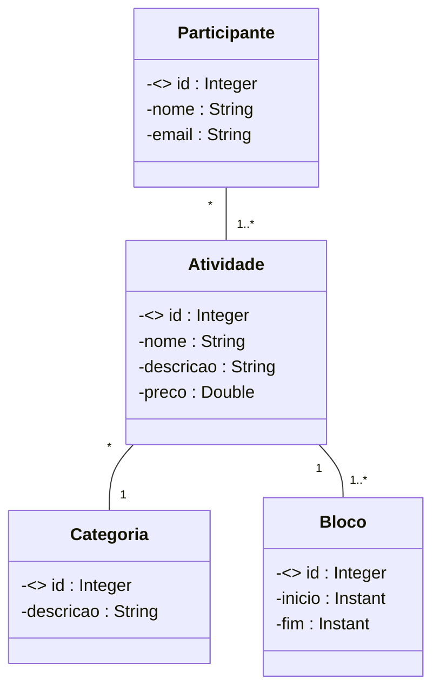
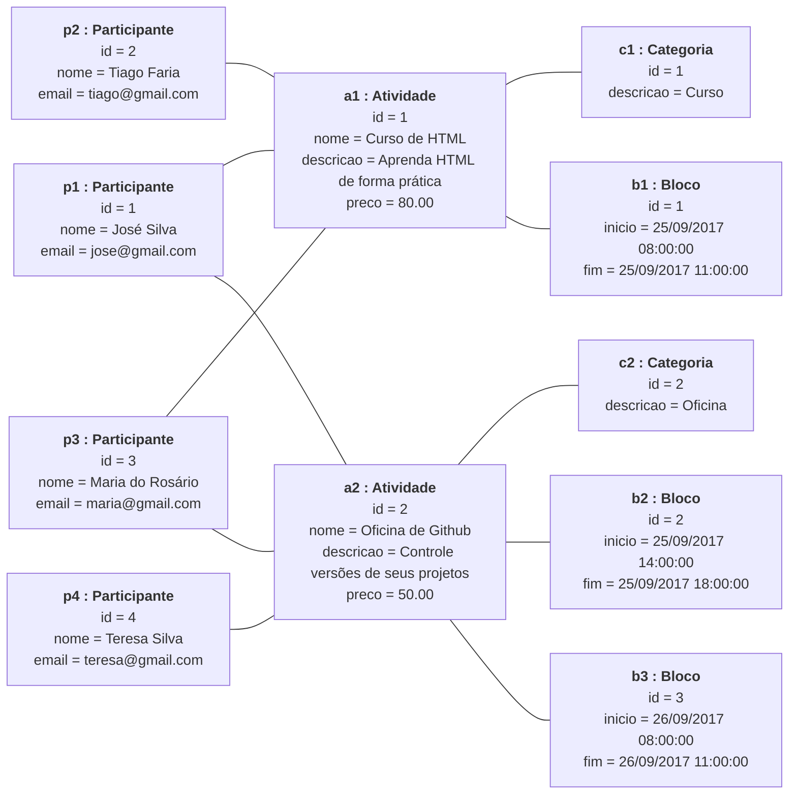

# DESAFIO: Modelo de domínio e ORM

## ESPECIFICAÇÃO - Sistema EVENTO

Deseja-se construir um sistema para gerenciar as informações dos participantes das atividades de um evento acadêmico. As atividades deste evento podem ser, por exemplo, palestras, cursos, oficinas práticas, etc. Cada atividade que ocorre possui nome, descrição, preço, e pode ser dividida em vários blocos de horários (por exemplo: um curso de HTML pode ocorrer em dois blocos, sendo necessário armazenar o dia e os horários de início de fim do bloco daquele dia). Para cada participante, deseja-se cadastrar seu nome e email.

### Modelo conceitual

**Papéis e multiplicidades das associações:**

| Classe A     | Papel de A        | Multiplicidade de A | Classe B  | Papel de B     | Multiplicidade de B |
|--------------|-------------------|---------------------|-----------|----------------|---------------------|
| Participante | `- participantes` | `*`                 | Atividade | `- atividades` | `1..*`              |
| Atividade    | `- atividades`    | `*`                 | Categoria | `- categoria`  | `1`                 |
| Atividade    | `- atividade`     | `1`                 | Bloco     | `- blocos`     | `1..*`              |

---

## Instância dos dados para *seeding*

### Diagrama de objetos

